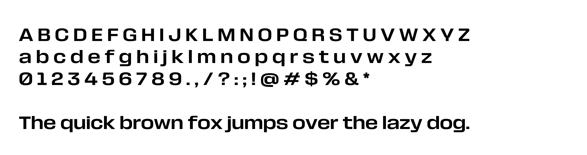
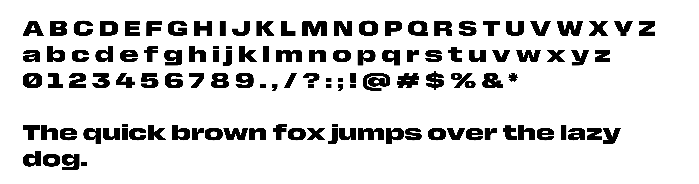
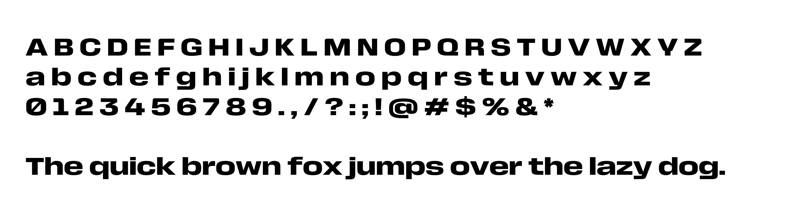
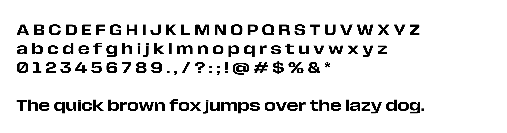
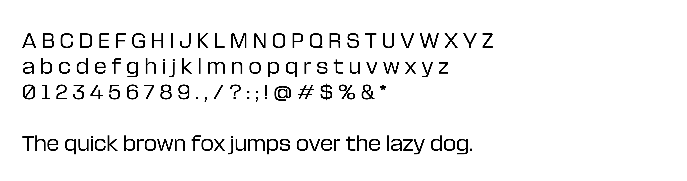
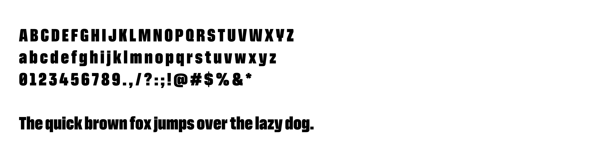
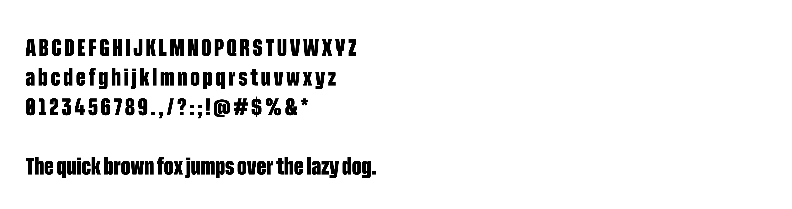

# FWC26 Font Family
The official proprietary font family "FWC26" made by FIFA® for the FIFA World Cup 2026™ including all typefaces, available for free in different formats (OTF, TTF and WOFF2).

# Font Preview
The same font sizee has been used for all typeface previews.

### FWC26 Normal Regular:

### FWC26 Normal Black:

### FWC26 Normal Bold:

### FWC26 Normal Medium:

### FWC26 Normal Thin:

### FWC26 Ultra Condensed Black:

### FWC26 Ultra Condensed Bold:

